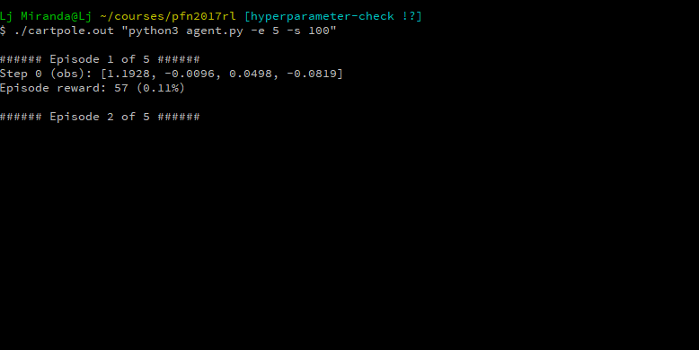
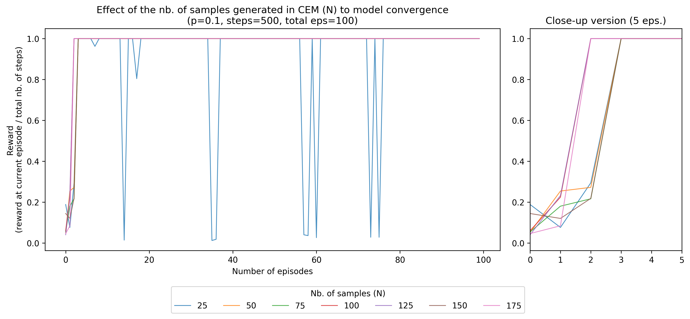
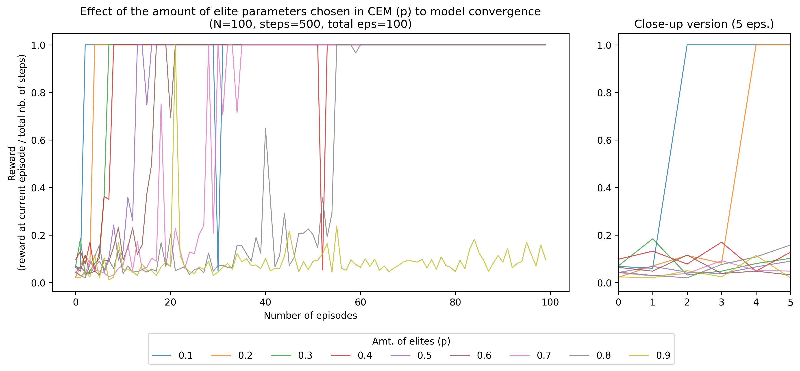
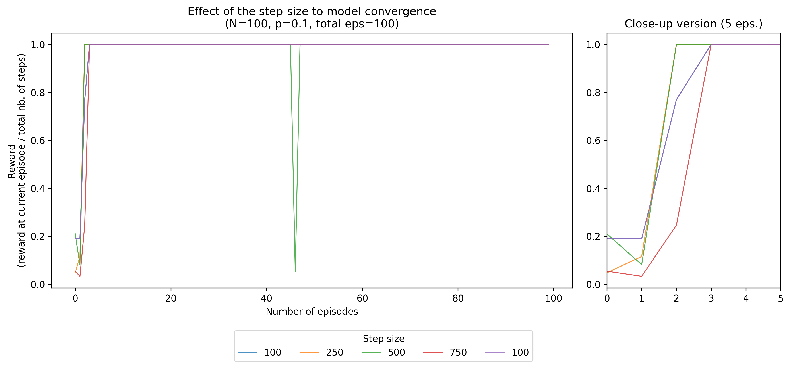

# Solutions to PFN Reinforcement Learning Task

[](https://travis-ci.org/ljvmiranda921/pfn-rl-practice)


This repository contains my solutions in the Preferred Networks Reinforcement
Learning problem set. The list of tasks can be found [here](https://github.com/pfnet/intern-coding-tasks/tree/master/2017/ml).
This year, the problem requires the development of a reinforcement learning
model to balance a cartpole using the cross-entropy method (linear policy).
There's an added challenge of using only the *Python standard library* in
performing the task, that's why you'll notice some code golfing in my work.

**Disclaimer:** I am **not** connected in any way with Preferred Networks
nor an intern in their company. So please don't take my *unchecked*
solutions as the official answer in their problem set.

## Dependencies

This repository was tested on both Linux Ubuntu 14.04.5 and Windows 10 (`cygwin`).
For the basic cartpole, only the Python 3.6 standard library was implemented.

## Compiling the host program

The host program contains the cartpole environment and was written in C++.
To compile the program, simply write the following:

```bash
g++ -std=c++11 cartpole.cc -o cartpole.out
```

This creates the host program `cartpole.out` that can be interacted by
flushing strings into the standard output.

## Running the agent

The agent can be found in `agent.py` and interacts with the host program.
This interaction is managed by a wrapper class `CartPoleEnv`. To run the
agent, simply write the following:

```bash
./cartpole.out "python3 agent.py"
```

This runs the agent for `100` episodes with a sampling size of `100` and
elite selection of `0.1`. Various arguments can be supplied to `agent.py`
to control these hyperparameters:

| Arg | Name          | Description                                                              |
|-----|---------------|--------------------------------------------------------------------------|
| -e  | episodes      | number of episodes to run the agent                                      |
| -n  | sampling size | size of the sample generated by the cross-entropy error                  |
| -p  | top samples   | number of top samples chosen for parameter update                        |
| -z  | step size     | number of steps for each episode                                         |
| -s  | print step    | number of steps before printing the output observation                   |
| -o  | output file   | filename to store the win ratio for each episode                         |
| -r  | random seed   | sets the random seed during program execution                            |

To see the list of all arguments, simpy enter the following command:

```bash
python3 agent.py -h
```

## Command-line demo

When the agent is ran, it will print the observations for every step, and the
total reward obtained for each episode. In the end, it will show the percentage
of episodes that reached a reward of 500.

```bash
./cartpole.out "python3 agent.py -e 5 -s 100"
```

Sample output:



## Effect of hyperparameters in convergence

Here we can check how adjusting various hyperparameters can affect the
convergence of our model. The x-axis represents the number of episodes
(up to 100), while the y-axis shows the reward at the current episode.

Here, the reward is represented as a win ratio, accounting the accumulated
score per step (default is 500) divided by the total number of steps. So
for a single episode with 500 steps, if the score obtained is 400, then the
win ratio is `400 / 500 = 0.2`. I represented the y-axis in this manner to
standardize the overall reward, especially in the third hyperparameter where
the actual no. of steps is adjusted.





## Todo

- Try using a neural network for policy